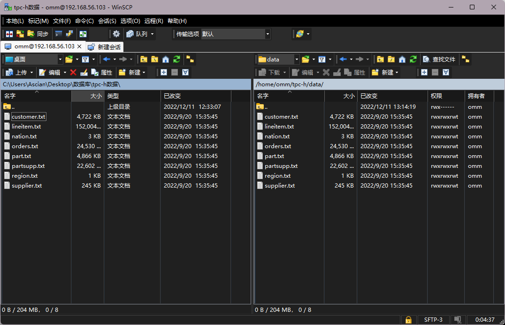

# 数据库实验平台OpenEuler的安装、OpenGauss数据库的安装即配置实验

## 实验目的

* 掌握 VirtualBox 软件的安装方法以及在 virtualBox 上创建 linux 虚拟机并安装 openEuler 系统的方法

* 掌握基本的 openEuler 系统的使用和配置方法

* 掌握 PuTTY 的基本使用方法

* 掌握 XML 配置文件的创建和书写方法

* 学会下载解压 OpenGauss 数据库

* 经行初始化等简单的配置

## 实验环境

虚拟机软件使用的是 VirtualBox6.1.14 版本，虚拟机上操作系统是 openEuler-20.03-LTS-x86_64。电脑建议使用 windows10 系统，内存建议 8GB 以上。

## 实验内容

* 安装 VirtualBox

* 安装 OpenEuler

* 安装 PuTTY

* 安装 OpenGauss

## 实验步骤（包括实验过程、实验结果、查询语句等等）

第一步，进入VirtualBox官网下载并安装VirtualBox

第二步，进入华为开源镜像站下载openEuler-20.03-LTS镜像文件

第三步，依据实验指导书中设置新建虚拟电脑

第四步，依据实验指导书中步骤安装openEuler

第五步，检查完网络后，安装PuTTY并连接虚拟机，之后可在PuTTY上按照实验指导书对openEuler进行相关配置

第六步，使用wget下载数据库安装包到安装包目录，并解压安装包

第七步，创建XML文件，用于数据安装，并将该文件作为参数，执行初始化脚本

最后，依据实验指导书初始化数据库完成数据库的安装

## 实验总结（包括遇到的问题、解决方案等）

该实验主要是完成openGauss数据的安装，为后续的实验做准备。实验指导书上有详细的步骤，只要细心的按照步骤一步一步来，就能较为容易的实现数据库的安装。

由于直接在虚拟机上无法复制粘贴命令，因此使用PuTTY工具远程连接虚拟机，直接将命令复粘贴到PuTTY上执行，能够减少输入错误的概率。唯一需要注意的一点是XML文件中的配置项需要按照自己虚拟机的数据库名和网络IP设置。

为了完整体验一次数据库的安装，因此本次试验并未使用数据库安装脚本。若要提高部署数据库的效率，可以将安装步骤写入shell脚本，实现一键式配置、下载、安装。

# OpenGauss数据库建表及数据导入实验

## 实验目的

* 了解 openGauss 的基本数据类型

* 学会根据现实场景中表中的数据，在 openGauss 创建对应的关系表

* 学会使用 gsql 元命令批量导入数据

## 实验环境

实验环境为 virtualBOX 虚拟机 openEuler20.03 系统上的 openGauss1.1.0 数据库，实验数据采用 TPC-H 数据库的八张表，实验过程会用到 WinSCP，Putty 软件。

## 实验内容

* 创建关系表

* 数据导入

## 实验步骤

输入`gsql -d postgres -p 26000 -r`以编辑模式连接数据库。然后使用 CREATE TABLE 命令创建各所需表

创建订单表 ORDERS

    postgres=# CREATE TABLE ORDERS ( O_ORDERKEY INTEGER NOT NULL,
    postgres(#  O_CUSTKEY INTEGER NOT NULL,
    postgres(#  O_ORDERSTATUS CHAR(1) NOT NULL,
    postgres(#  O_TOTALPRICE DECIMAL(15,2) NOT NULL,
    postgres(#  O_ORDERDATE DATE NOT NULL,
    postgres(#  O_ORDERPRIORITY CHAR(15) NOT NULL,
    postgres(#  O_CLERK CHAR(15) NOT NULL,
    postgres(#  O_SHIPPRIORITY INTEGER NOT NULL,
    postgres(#  O_COMMENT VARCHAR(79) NOT NULL);
    CREATE TABLE

创建区域表 REGION

    postgres=# CREATE TABLE REGION ( R_REGIONKEY INTEGER NOT NULL,
    postgres(#  R_NAME CHAR(25) NOT NULL,
    postgres(#  R_COMMENT VARCHAR(152));
    CREATE TABLE

创建国家表 NATION

    postgres=# CREATE TABLE NATION ( N_NATIONKEY INTEGER NOT NULL,
    postgres(#  N_NAME CHAR(25) NOT NULL,
    postgres(#  N_REGIONKEY INTEGER NOT NULL,
    postgres(#  N_COMMENT VARCHAR(152));
    CREATE TABLE

创建供应商表 SUPPLIER

    postgres=# CREATE TABLE SUPPLIER ( S_SUPPKEY INTEGER NOT NULL,
    postgres(#  S_NAME CHAR(25) NOT NULL,
    postgres(#  S_ADDRESS VARCHAR(40) NOT NULL,
    postgres(#  S_NATIONKEY INTEGER NOT NULL,
    postgres(#  S_PHONE CHAR(15) NOT NULL,
    postgres(#  S_ACCTBAL DECIMAL(15,2) NOT NULL,
    postgres(#  S_COMMENT VARCHAR(101) NOT NULL);
    CREATE TABLE

创建零部件表 PART

    postgres=# CREATE TABLE PART ( P_PARTKEY INTEGER NOT NULL,
    postgres(#  P_NAME VARCHAR(55) NOT NULL,
    postgres(#  P_MFGR CHAR(25) NOT NULL,
    postgres(#  P_BRAND CHAR(10) NOT NULL,
    postgres(#  P_TYPE VARCHAR(25) NOT NULL,
    postgres(#  P_SIZE INTEGER NOT NULL,
    postgres(#  P_CONTAINER CHAR(10) NOT NULL,
    postgres(#  P_RETAILPRICE DECIMAL(15,2) NOT NULL,
    postgres(#  P_COMMENT VARCHAR(23) NOT NULL );
    CREATE TABLE

创建零部件供应商表 PARTSUPP

    postgres=# CREATE TABLE PARTSUPP ( PS_PARTKEY INTEGER NOT NULL,
    postgres(#  PS_SUPPKEY INTEGER NOT NULL,
    postgres(#  PS_AVAILQTY INTEGER NOT NULL,
    postgres(#  PS_SUPPLYCOST DECIMAL(15,2) NOT NULL,
    postgres(#  PS_COMMENT VARCHAR(199) NOT NULL );
    CREATE TABLE

创建客户表 CUSTOMER

    postgres=# CREATE TABLE CUSTOMER ( C_CUSTKEY INTEGER NOT NULL,
    postgres(#  C_NAME VARCHAR(25) NOT NULL,
    postgres(#  C_ADDRESS VARCHAR(40) NOT NULL,
    postgres(#  C_NATIONKEY INTEGER NOT NULL,
    postgres(#  C_PHONE CHAR(15) NOT NULL,
    postgres(#  C_ACCTBAL DECIMAL(15,2) NOT NULL,
    postgres(# C_MKTSEGMENT CHAR(10) NOT NULL,
    postgres(#  C_COMMENT VARCHAR(117) NOT NULL);
    CREATE TABLE

创建订单明细表 LINEITEM

    postgres=# CREATE TABLE LINEITEM ( L_ORDERKEY INTEGER NOT NULL,
    postgres(#  L_PARTKEY INTEGER NOT NULL,
    postgres(#  L_SUPPKEY INTEGER NOT NULL,
    postgres(#  L_LINENUMBER INTEGER NOT NULL,
    postgres(#  L_QUANTITY DECIMAL(15,2) NOT NULL,
    postgres(#  L_EXTENDEDPRICE DECIMAL(15,2) NOT NULL,
    postgres(#  L_DISCOUNT DECIMAL(15,2) NOT NULL,
    postgres(#  L_TAX DECIMAL(15,2) NOT NULL,
    postgres(#  L_RETURNFLAG CHAR(1) NOT NULL,
    postgres(#  L_LINESTATUS CHAR(1) NOT NULL,
    postgres(#  L_SHIPDATE DATE NOT NULL,
    postgres(#  L_COMMITDATE DATE NOT NULL,
    postgres(#  L_RECEIPTDATE DATE NOT NULL,
    postgres(#  L_SHIPINSTRUCT CHAR(25) NOT NULL,
    postgres(#  L_SHIPMODE CHAR(10) NOT NULL,
    postgres(#  L_COMMENT VARCHAR(44) NOT NULL);
    CREATE TABLE

以上操作完成了8张表的创建，输入`\d`查看所有已创建表，并输入`\d TABLENAME`依次查看所创建表的属性，确认无误后开始下一步操作。

接着使用WinSCP连接上虚拟机，以omm用户身份登录，将tpc-h的数据上传到`home/omm/tpc-h/data`目录下

使用 \copy 命令将上传的数据导入之前创建的表

    postgres=# copy region FROM '/home/omm/tpc-h/data/region.txt' with delimiter as '|';
    COPY 5
    postgres=# copy nation FROM '/home/omm/tpc-h/data/nation.txt' with delimiter as '|';
    COPY 25
    postgres=# copy part FROM '/home/omm/tpc-h/data/part.txt' with delimiter as '|';
    COPY 40000
    postgres=# copy supplier FROM '/home/omm/tpc-h/data/supplier.txt' with delimiter as '|';
    COPY 2000
    postgres=# copy customer FROM '/home/omm/tpc-h/data/customer.txt' with delimiter as '|';
    COPY 30000
    postgres=# copy lineitem FROM '/home/omm/tpc-h/data/lineitem.txt' with delimiter as '|';
    COPY 1199969
    postgres=# copy partsupp FROM '/home/omm/tpc-h/data/partsupp.txt' with delimiter as '|';
    COPY 160000
    postgres=# copy orders FROM '/home/omm/tpc-h/data/orders.txt' with delimiter as '|';
    COPY 300000

之后为各表添加主键约束和外键约束

    postgres=# ALTER TABLE REGION ADD PRIMARY KEY (R_REGIONKEY);
    NOTICE:  ALTER TABLE / ADD PRIMARY KEY will create implicit index "region_pkey" for table "region"
    ALTER TABLE
    postgres=# ALTER TABLE NATION ADD PRIMARY KEY (N_NATIONKEY);
    NOTICE:  ALTER TABLE / ADD PRIMARY KEY will create implicit index "nation_pkey" for table "nation"
    ALTER TABLE
    postgres=# ALTER TABLE NATION ADD FOREIGN KEY (N_REGIONKEY) references REGION;
    ALTER TABLE
    postgres=# ALTER TABLE PART ADD PRIMARY KEY (P_PARTKEY);
    NOTICE:  ALTER TABLE / ADD PRIMARY KEY will create implicit index "part_pkey" for table "part"
    ALTER TABLE
    postgres=# ALTER TABLE SUPPLIER ADD PRIMARY KEY (S_SUPPKEY);
    NOTICE:  ALTER TABLE / ADD PRIMARY KEY will create implicit index "supplier_pkey" for table "supplier"
    ALTER TABLE
    postgres=# ALTER TABLE SUPPLIER ADD FOREIGN KEY (S_NATIONKEY) references NATION;
    ALTER TABLE
    postgres=# ALTER TABLE PARTSUPP ADD PRIMARY KEY (PS_PARTKEY,PS_SUPPKEY);
    NOTICE:  ALTER TABLE / ADD PRIMARY KEY will create implicit index "partsupp_pkey" for table "partsupp"
    ALTER TABLE
    postgres=# ALTER TABLE CUSTOMER ADD PRIMARY KEY (C_CUSTKEY);
    NOTICE:  ALTER TABLE / ADD PRIMARY KEY will create implicit index "customer_pkey" for table "customer"
    ALTER TABLE
    postgres=# ALTER TABLE CUSTOMER ADD FOREIGN KEY (C_NATIONKEY) references NATION;
    ALTER TABLE
    postgres=# ALTER TABLE LINEITEM ADD PRIMARY KEY (L_ORDERKEY,L_LINENUMBER);
    NOTICE:  ALTER TABLE / ADD PRIMARY KEY will create implicit index "lineitem_pkey" for table "lineitem"
    ALTER TABLE
    postgres=# ALTER TABLE ORDERS ADD PRIMARY KEY (O_ORDERKEY);
    NOTICE:  ALTER TABLE / ADD PRIMARY KEY will create implicit index "orders_pkey" for table "orders"
    ALTER TABLE
    postgres=# ALTER TABLE PARTSUPP ADD FOREIGN KEY (PS_SUPPKEY) references SUPPLIER;
    ALTER TABLE
    postgres=# ALTER TABLE PARTSUPP ADD FOREIGN KEY (PS_PARTKEY) references PART;
    ALTER TABLE
    postgres=# ALTER TABLE ORDERS ADD FOREIGN KEY (O_CUSTKEY) references CUSTOMER;
    ALTER TABLE
    postgres=# ALTER TABLE LINEITEM ADD FOREIGN KEY (L_ORDERKEY) references ORDERS;
    ALTER TABLE
    postgres=# ALTER TABLE LINEITEM ADD FOREIGN KEY (L_PARTKEY,L_SUPPKEY) references PARTSUPP;
    ALTER TABLE

最后使用`select * from tablename`语句一一检查每个表是否导入数据正确，完成数据导入。

## 实验总结

TODU:
本次试验主要完成了，表的创建和数据的导入。

# 数据查询与修改实验

## 实验目的

对前面实验建立的电商数据库关系表进行各种类型的查询操作和修改操作，加深对 SQL 语言中 DML的了解，掌握相关查询语句和数据修改语句的使用方法。

## 实验环境

本实验环境为 virtualBOX 虚拟机 openEuler20.03 系统上的 openGauss1.1.0/openGauss2.0.0 数据库和华为云GaussDB(openGauss)数据库，实验数据采用电商数据库的八张表

## 实验内容

* 单表简单查询，包括复合选择条件、结果排序、结果去重、结果重命名查询

* 多表查询，包括等值连接、自然连接、元组变量查询

* 统计查询，包括带有分组、聚集函数的查询

* 嵌套查询，包括带有 in/some/all、 exists、unique 的嵌套查询，from 中子查询

* with 临时视图查询

* 键/函数依赖分析

* 表的插入、删除、更新

## 实验步骤

**查询1：从订单表ORDERS表中，找出由收银员Clerk#000000951处理的满足下列条件的所有订单o_orderkey：**
* 订单总价位于[10000, 50000]
* 下单日期在'2020-01-01'至'2020-12-31'之间
* 订单状态 O_ORDERSTATUS 不为空

列出这些订单的订单 key（O_ORDERKEY）、客户 key、订单状态、订单总价、下单日期、订单优先级和发货优先级；

要求：对查询结果，按照订单优先级从高到低、发货优先级从高到低排序，并且将 O_ORDERDATE 重新命名为 O_DATE。

查询语句输入如下：

    select o_orderkey, o_custkey, o_orderstatus, o_totalprice, o_orderdate as o_date, o_orderpriority, o_shippriority
    from orders
    where o_clerk='Clerk#000000951'
    and o_totalprice between 10000 and 50000
    and o_orderdate between '2020-01-01'::date and '2020-12-31'::date
    and o_orderstatus is not null
    order by o_orderpriority desc, o_shippriority desc;

使用`EXPLAIN ANALYSE`语句可以获取查询所需时间和查询结果数量。一共获取8行数据，耗时105ms。

**查询2：从订单明细表 LINEITEM 表中，找出满足下列条件的所有订单 L_ORDERKEY：**
* 数量位于[10, 100]，
* 退货标志为‘N’的订单中，价格不小于10000

列出这些订单的 key 和零件供应商 key、价格；
要求：对查询结果，按照价格从高到低排序，并且对查询结果使用 distinct 去重。

比较对查询结果去重和不去重，在查询时间和查询结果上的差异。

去重的查询语句输入如下：

    select distinct l_orderkey, l_suppkey, l_extendedprice
    from lineitem
    where l_quantity between 10 and 100
    and l_returnflag='N'
    and l_extendedprice >= 10000
    order by l_extendedprice desc;

使用`EXPLAIN ANALYSE`语句对比去重和不去重的查询结果，发现去重和不去重的数量分别为498300和498304，仅仅有4行的差距。查询时间分别为1104ms和951ms，产生了150ms的差距，相当于不去重耗时的16%。

**查询3：从客户表 CUSTOMER 表中，找出满足下列条件的客户：**
* 客户电话开头部分包含‘10’，或者客户市场领域中包含“BUILDING”
* 客户电话结尾不为‘8’。

查询语句输入如下：

    select c_custkey
    from customer
    where (c_phone like '10%' or c_mktsegment like '%BUILDING%')
    and c_phone not like '%8';

使用`EXPLAIN ANALYSE`语句获得查询结果数为26915，查询时间为29ms。

**查询4：从客户表 CUSTOMER 表中，找出满足下列条件的客户姓名**
* 客户 key 由 2 个字符组成
* 客户地址至少包括 18 个字符，即地址字符串的长度不小于 18。

查询语句输入如下：

    select c_name
    from customer
    where c_custkey like '__'
    and length(c_address) >= 18;

使用`EXPLAIN ANALYSE`语句获得查询结果数为64，查询时间为41ms。

**查询5：使用集合并操作 union、union all，从订单明细表 LINEITEM 查询满足下列条件的订单 key**
* 订单发货日期早于‘2016-01-01’或者订单数量大于 100

对比 union all、union 操作在查询结果、执行时间上的差异

使用union all查询语句如下：

    select l_orderkey 
    from lineitem
    where l_shipdate < '2016-01-01'::date
    union all
    select l_orderkey
    from lineitem
    where l_quantity > 100;

使用union查询语句如下：

    select l_orderkey 
    from lineitem
    where l_shipdate < '2016-01-01'::date
    union
    select l_orderkey
    from lineitem
    where l_quantity > 100;

使用`EXPLAIN ANALYSE`语句获取到了两个查询语句的查询结果数分别为151587和41621，查询时间分别为916ms和667ms。由于union all保留了重复元祖，因此查询结果数和查询时间都要明显多于去重的union。

**查询6：结合教材 3.4.1 节元组变量样例，使用集合操作 except、except all，从供应商表 SUPPLIER 中，查询账户余额最大的供应商。**

对比使用 except、except all、聚集函数 max，对比完成此查询在执行时间、查询结果上的异同。

使用except查询语句如下：

    select s_suppkey
    from supplier 
    except(
      select t1.s_suppkey
      from supplier t1, supplier t2
      where t1.s_acctbal < t2.s_acctbal
    );

使用except all查询语句如下：

    select s_suppkey
    from supplier 
    except all(
      select t1.s_suppkey
      from supplier t1, supplier t2
      where t1.s_acctbal < t2.s_acctbal
    );

使用max查询语句如下：

    select s_suppkey, s_name
    from supplier
    where s_acctbal=(
      select max(s_acctbal)
      from supplier
    );

使用`EXPLAIN ANALYSE`语句获取到了三个查询语句的查询结果数分别为1、1和1，查询时间分别为2908ms、2583ms和1ms。三者的查询结果的为1个，但使用max语句的查询时间要远远小于使用except语句耗费的时间。

**查询7：选取两张数据量比较小的表 T1 和 T2，如地区表 REGION、国家表 NATION、供应商表 SUPPLIER，执行如下无连接条件的笛卡尔积操作，观察数据库系统的反应和查询结果：**

查询语句如下：

    select * from region, nation;

使用`EXPLAIN ANALYSE`语句获得查询结果数为125，查询时间为0.1ms。两个行数分别为5和25的表，产生了一张125行的表，表项依旧较少，因此耗时很短。

**查询8：使用多表连接操作（3.3.3 join/natural join，4.1.1 join），从订单表 ORDERS、供应商表 SUPPLIER、订单明细表 LINEITEM 中，查询实际到达日期小于预计到达日期的订单，列出这些订单的订单 key、订单总价、下单日期以及该供应商的姓名、地址和手机号。**

查询语句如下：

    select o_orderkey, o_totalprice, o_orderdate, s_name, s_address, s_phone
    from lineitem join orders on l_orderkey = o_orderkey join supplier on s_suppkey = l_suppkey
    where l_receiptdate < l_commitdate;

使用`EXPLAIN ANALYSE`语句获得查询结果数为133613，查询时间为790ms。

## 实验总结

# 数据库完整性与安全性实验

# 数据库接口实验

# 事务及其并发控制实验